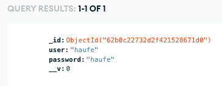

# Rick & Morty Challenge


The project is divided in two parts, the client and the backend. In the email it will the information that the developer will need to try the user creation functionality.

### Client

The client is developed in React and Redux. I wanted to have a smiliar style than the 'The Rick and Morty API' page. But adding extra styles like the possibility to add the character as favorite stored in Redux when the user clicks to the star when accessing a detailed character page. For the testing I used Jest and React Testing Library

### Architecture

```
/client
    ├── /assets        // images and svg files used in the application
    ├── /components    // generic components with its styles and test suites
    ├── /redux         // Store configuration and character reducer with react tool kit
    ├── /views         // component that do requets to the API
    ├── App.js         // routes and title defined
    ├── App.css
    ├── App.test.js
    └── index.js       // entry point for the app, Provider for redux store
```

All requests from the client are directly to the Express server and the routing is made by React router dom v6. Using Redux was very useful because I only had to fetch data once, after that the store it's persistant in the SPA but not saved in the database.

When the user types a wrong URL like `http://localhost:3000/wrong-url` it will display a 404 page and when you click the image it will redirect back to the home page.


### Backend

The backend is developed in Node using Express. I wanted to use a remote mongodb database using Atlas and I managed to make the connection and store the user but I ran out of time so I coudln't implement the Login and consume the application under a logged user.

To avoid handling too much information in the `/characters` request I only use the first 20 records that the API provides.

### Architecture

```
/client
    ├── /models        // the model used for the user creation form
    ├── .env           // required configuration. MONGODB_URI will be shared within the email.
    └── server.js      // server configuration, mongodb connection and all the endpoints created to use in from the client side
```

### To improve

I enjoyed very much the backend side, I don't have professional experience in the backend side but it was really fun trying to understand how the backend world works (or at least a little bit) and I hope I can learn a lot more in the company. 

The things I would improve if I had more time would be do the Login and returning a token for the user validation and also include all the data inside the DB and consume it directly from there.

The developer who will evaluate this challenge won't be able to see if the user is created since I used a remote db with mongodb Atlas. But I can share this picture. (the password should be hashed, but I ran out of time).



I would love to talk about this challenge in the next phase, then I can show you live the small database with the user creation example if you are interested :)


### Feedback

I would love to hear some feedback from you to know which areas can be improved.

I hope you like the project.

Happy coding!

---

# Requirements
## General
We need a fancy application, with backend and frontend, which consume the public API of
Rick & Morty: https://rickandmortyapi.com. This API should be consumed from your backend
application, not directly from the frontend.

We need these functionalities:

• Login
The users need to be authenticated to consume the application. The auth have to keep
the state between reloads.

• List all character’s view
An indicator to know if a character is in fav list.

• Detail character’s view
A button to add the character to a fav list, in case the character is in fav list it will be
removed from fav list.

• 404 page

## Rules

• The frontend will be made in React with Hooks and Redux. Feel free if you want to add
more JS libraries but if you do that, please, tell us in the Readme.md file why did you
choose them. Design is free.

• The backend will be made in Express. Feel free if you want to add more JS libraries but
if you do that, please, tell us in the Readme.md file why did you choose them.

• Please, don’t use styles libraries like Bootstrap or Material. We need to know your skills
and we assume the application won't be a stellar designed app.

• Make focus on quality. We won’t care a lot if you don't finish all points, but we will
care a lot the quality of what you created.

• The user information for login should be stored in a DB. Feel free to choose the DB you
consider.

• When a user saves characer in fav list it should be reflected on DB. Feel free to choose the
DB you consider.

• The application must be delivered in a repo. If you want to keep it in secret just create a
fake account in GitHub.

## Extra points (optional)
These extra points are not mandatory. If you have time and desire go ahead!
• Add test. Feel free to decide how and where.
• Add a register page for new users.
• Add backend pagination
• Preload images and add a loader
• Take a beer, you worked a lot!
